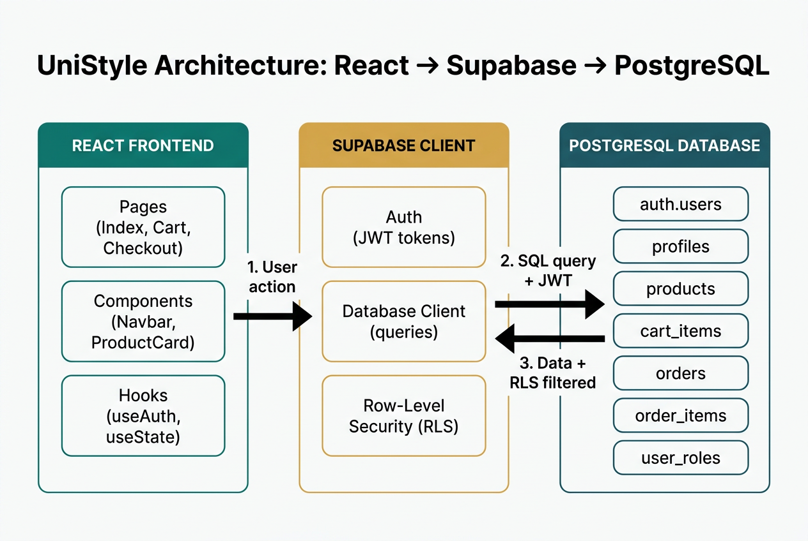

# UniStyle — Project Documentation

A complete, beginner-friendly guide to the UniStyle ecommerce website.

---

## 0. Branding & Visual Identity

UniStyle has its own custom brand identity built from a logo provided by the team.

### Logo assets
| File | Where it's used |
|---|---|
| `src/assets/unistyle-logo.png` | Full wordmark logo — shown big in the home page **hero section** |
| `src/assets/unistyle-mark.png` | Small icon-only mark — shown in the **navbar** (top-left) next to the "UniStyle" text |
| `public/favicon.png` | Browser tab icon (favicon) |

### Color palette (pulled from the logo)
We use a **deep teal + gold on warm white** palette. All colors are defined as HSL CSS variables in `src/index.css` so they can be reused everywhere through Tailwind classes (`bg-primary`, `text-accent`, etc.).

| Token | HSL value | Meaning |
|---|---|---|
| `--background` | `40 30% 98%` | Warm off-white page background |
| `--foreground` | `200 60% 12%` | Main text color (near-black teal) |
| `--primary` | `198 75% 18%` | **Deep teal** — buttons, brand text, navbar word |
| `--accent` | `42 70% 55%` | **Gold** — highlights, premium feel |
| `--secondary` | `195 30% 94%` | Soft teal-tinted background for hero/sections |
| `--muted-foreground` | `200 20% 38%` | Subtle helper text |
| `--brand-gradient` | teal → gold linear gradient | Reusable premium gradient |
| `--shadow-brand` | soft teal drop shadow | Reusable elevated shadow |

### Why a design system?
Instead of writing `text-white` or `bg-[#003344]` directly in components, we use **semantic tokens** (`bg-primary`, `text-foreground`). This means:
- Changing one variable in `index.css` instantly re-themes the whole app.
- Light/dark mode work automatically.
- The site stays visually consistent everywhere.

---

## 1. Project Overview

**UniStyle** is a small online store for **unisex clothing and accessories** (men's wear, women's wear, watches, sunglasses, bags, etc.). It is a **college project** designed to teach the basics of building a real-world web application.

### Why was it built?
- To learn how a real ecommerce site (like Amazon, Myntra, Flipkart) works.
- To practice using a database, login system, and shopping cart together.
- To have a complete, working project that can be submitted and explained in viva.

### Real-life example
Imagine a clothing shop in a mall:
- **Shelves with clothes** = the **product list** on the home page.
- **Customer picking items into a basket** = the **add-to-cart** feature.
- **Counter where you pay and give your address** = the **checkout** page.
- **Shop manager adding/removing items from shelves** = the **admin panel**.

---

## 2. Features Explanation

### 🔐 Login & Signup
Just like getting a membership card at a mall — you sign up once, then log in to remember your cart and orders.

### 👕 Product Listing (Home Page)
Like walking around a clothing store and seeing all items on display. You can filter by section: Men, Women, or Accessories.

### 🔍 Product Detail Page
Like picking up a shirt to read its tag — you see a bigger photo, the price, and a short description.

### 🛒 Add to Cart
Like putting items into a shopping basket while you browse. You can change quantity or remove items before paying.

### 💵 Checkout (Cash on Delivery)
Like walking to the counter, telling the cashier your name and address, and confirming the order. You pay in cash when the order arrives.

### 📦 Order History
Like keeping all your shopping receipts in one folder so you can look back at what you bought.

### 🛠️ Admin Panel
Only the **shop manager (admin)** can:
- Add new products to the shelves
- Edit product details (name, price, image)
- Delete products
- View all customer orders and update their status (Pending → Shipped → Delivered)

---

## 3. Folder & File Structure

```
unistyle/
├── DOCUMENTATION.md              ← This file
├── index.html                    ← The single HTML page that loads the React app + SEO meta tags
├── public/
│   └── favicon.png               ← UniStyle logo shown in the browser tab
├── src/
│   ├── main.tsx                  ← Entry point — starts the React app
│   ├── App.tsx                   ← Defines all the URLs (routes) of the website
│   ├── index.css                 ← Brand design tokens (teal/gold), global theme
│   │
│   ├── assets/
│   │   ├── unistyle-logo.png     ← Full wordmark logo (used in home hero)
│   │   └── unistyle-mark.png     ← Icon-only mark (used in navbar)
│   │
│   ├── components/
│   │   ├── Navbar.tsx            ← Top navigation bar (logo, cart, login button)
│   │   ├── ProductCard.tsx       ← One product tile shown on the home page grid
│   │   └── ProtectedRoute.tsx    ← Blocks pages from non-logged-in users
│   │
│   ├── pages/
│   │   ├── Index.tsx             ← Home page (hero with logo + product grid + filter)
│   │   ├── Auth.tsx              ← Login + Signup form
│   │   ├── ProductDetail.tsx     ← Single product page with Add to Cart
│   │   ├── Cart.tsx              ← Shopping cart page
│   │   ├── Checkout.tsx          ← Place an order (Cash on Delivery)
│   │   ├── Orders.tsx            ← User's past orders
│   │   ├── AdminProducts.tsx     ← Admin: add/edit/delete products
│   │   ├── AdminOrders.tsx       ← Admin: view orders + update status
│   │   └── NotFound.tsx          ← 404 page
│   │
│   ├── hooks/
│   │   └── useAuth.tsx           ← Knows who is logged in + if they are admin
│   │
│   └── integrations/supabase/
│       ├── client.ts             ← Connection to the database
│       └── types.ts              ← Auto-generated database types
│
└── supabase/migrations/          ← SQL files that built the database tables
```

### What does each file do (in plain English)?
| File | What it does |
|---|---|
| `App.tsx` | The "map" of the website — says which page opens at `/cart`, `/auth`, etc. |
| `Navbar.tsx` | Top bar with the UniStyle icon, brand name, cart, orders, admin & login buttons. |
| `index.css` | The **brand design system** — teal/gold colors, gradients, shadows. |
| `useAuth.tsx` | A "memory" that remembers if you are logged in and whether you are admin. |
| `client.ts` | The "telephone line" to the database. Whenever we need data, we use this. |
| `Index.tsx` | The home page — UniStyle logo hero + filterable product grid. |
| `Cart.tsx` | Shows what's in your shopping basket and lets you change it. |
| `unistyle-logo.png` | Big wordmark used in the homepage hero. |
| `unistyle-mark.png` | Small icon shown in the navbar on every page. |

---

## 3.5 Folder & File Structure — Explained Like You're 12 🧒

Imagine the whole website is a **giant LEGO castle**. Every folder is a **room** in the castle, and every file is a **LEGO brick** with a special job. Let's walk through the castle one room at a time.

### 🏠 The Front Door — `index.html`
This is the **front door** of the castle. When someone types our website address in their browser, this is the very first thing that opens.
- It's just a tiny HTML page with one empty `<div id="root">`.
- React then "moves in" and fills that empty div with our entire app.
- It also holds the **page title** ("UniStyle"), the **favicon** (browser tab icon), and SEO tags (so Google knows what our site is about).

### 🔌 The Power Switch — `src/main.tsx`
This is the **power switch** that turns React on.
- It grabs the empty `<div id="root">` from `index.html`.
- It tells React: "Hey, render the `<App />` component inside this div."
- Without this file, nothing would appear on screen — like a TV with no power.

### 🗺️ The Map — `src/App.tsx`
This file is like a **map of the castle**. It says: "If a visitor walks to door `/cart`, show them the Cart room. If they walk to `/auth`, show them the Login room."
- It uses a tool called **React Router** to handle URLs.
- It also wraps the whole app in helpers like `AuthProvider` (remembers who's logged in) and `QueryClientProvider` (helps load data smoothly).
- Think of it as the **hallway** that connects all the rooms.

### 🎨 The Paint & Decorations — `src/index.css`
This is the castle's **paint bucket and decoration kit**.
- It defines all our **brand colors** (teal, gold, warm white) as reusable variables.
- Anywhere in the app where we write `bg-primary`, it pulls the teal color from here.
- Change one line here, and the whole castle gets repainted instantly. Magic! ✨

---

### 📦 The `public/` Room — Public Goodies
Anything inside `public/` is served **as-is** to the browser, no processing.
- `favicon.png` — the tiny icon you see in the browser tab.
- `robots.txt` — a note for Google's web crawlers saying "yes, please index this site."
- `placeholder.svg` — a fallback image we show when a product has no picture.

> 💡 Rule of thumb: if you want a file to be downloadable by URL directly (like `mysite.com/favicon.png`), put it in `public/`.

---

### 🖼️ The `src/assets/` Room — Brand Pictures
This is the **art gallery**. It holds images that are part of our app's design (not user-uploaded photos).
- `unistyle-logo.png` — the big wordmark logo on the home page hero.
- `unistyle-mark.png` — the small icon-only mark in the navbar.

When we `import logo from "@/assets/unistyle-logo.png"` in a component, the build tool (Vite) **optimizes and bundles** these images automatically.

---

### 🧱 The `src/components/` Room — Reusable LEGO Bricks
A **component** is a small, reusable piece of UI. Think of it like a LEGO brick: build it once, snap it in wherever you need it.

| File | What it is | Real-life analogy |
|---|---|---|
| `Navbar.tsx` | The top bar with logo, cart, orders, login | The **welcome desk** at the entrance — it's the same on every floor |
| `ProductCard.tsx` | One product tile (image + name + price) | A **price tag on a hanger** — many tags, all look the same |
| `ProtectedRoute.tsx` | A bouncer that blocks pages if you're not logged in | A **velvet rope** at a VIP section |
| `NavLink.tsx` | A styled link used inside the navbar | A **signpost** pointing to a room |

Inside `components/ui/` are the **shadcn/ui** building blocks (`Button`, `Card`, `Input`, `Dialog`, etc.). These are pre-built, beautiful UI pieces we use across the app — like a **bag of standard LEGO pieces** you can use to build anything.

---

### 📄 The `src/pages/` Room — Full Rooms in the Castle
While **components** are bricks, **pages** are entire **rooms**. Each file here is a full screen the user can visit.

| Page | URL | What happens here |
|---|---|---|
| `Index.tsx` | `/` | The **home page** — see the logo and browse all products |
| `Auth.tsx` | `/auth` | The **sign-in counter** — log in or create an account |
| `ProductDetail.tsx` | `/product/:id` | The **product display table** — see details and add to cart |
| `Cart.tsx` | `/cart` | The **shopping basket** — review what you picked |
| `Checkout.tsx` | `/checkout` | The **cashier counter** — enter address and place order |
| `Orders.tsx` | `/orders` | The **receipt folder** — see all your past orders |
| `AdminProducts.tsx` | `/admin/products` | The **stockroom** — admins add/edit/delete products |
| `AdminOrders.tsx` | `/admin/orders` | The **manager's desk** — admins update order status |
| `NotFound.tsx` | `*` (anything else) | A friendly **"oops, wrong room"** sign |

---

### 🧠 The `src/hooks/` Room — Tiny Brains
A **hook** in React is a small reusable brain that gives a component a special power.

| File | Special power |
|---|---|
| `useAuth.tsx` | Remembers **who's logged in** and **whether they're an admin**. Used everywhere we need to check the user. |
| `use-toast.ts` | Lets any component **pop up a little notification** (e.g., "Added to cart!"). |
| `use-mobile.tsx` | Tells the component **if the screen is a phone** so it can show a different layout. |

> Think of hooks like **walkie-talkies** — any component can pick one up and instantly know what's happening across the app.

---

### 🛠️ The `src/lib/` Room — Helper Tools
Tiny utility helpers that don't belong anywhere else.
- `utils.ts` — has a `cn()` function that **smartly joins CSS class names** together. Used all over the app.

---

### 📡 The `src/integrations/supabase/` Room — Telephone to the Database
This is the **telephone line** to our backend (Lovable Cloud / Supabase).
- `client.ts` — creates the `supabase` object. Anywhere we want to read or save data, we import this. **Auto-generated, never edit.**
- `types.ts` — auto-generated TypeScript types that match every table in our database. Gives us autocomplete and catches typos. **Auto-generated, never edit.**

---

### 🗄️ The `supabase/` Room — Backend Blueprints
- `migrations/` — SQL files that **created** all our database tables (`products`, `orders`, `user_roles`, etc.). Like the **architectural blueprints** of the castle's basement vault.
- `config.toml` — settings for the backend (project ID, function configs).

---

### ⚙️ The Castle's Rulebooks (Config Files)
These live at the project root and tell tools **how** to build, lint, and run the app.

| File | What it does (kid version) |
|---|---|
| `package.json` | The **shopping list** of all the libraries our app uses (React, Tailwind, etc.) |
| `vite.config.ts` | Settings for **Vite**, the tool that bundles our code super fast |
| `tailwind.config.ts` | Settings for **Tailwind CSS** — tells it which colors and sizes are allowed |
| `tsconfig.json` | Settings for **TypeScript** — the language that catches bugs before they happen |
| `eslint.config.js` | Rules for **clean code** — like a teacher checking grammar |
| `postcss.config.js` | Helper that **processes CSS** before sending it to the browser |
| `components.json` | Config for **shadcn/ui** — tells it where to put new UI bricks |
| `.env` | **Secret keys** (like passwords) for connecting to the database. Auto-generated. |

---

### 📜 The `README.md` and `DOCUMENTATION.md`
- `README.md` — a short intro, like the **welcome plaque** at the castle entrance.
- `DOCUMENTATION.md` — this big book you're reading right now! 📖

---

## 3.6 Code Concepts — Explained for Beginners 👶

Before reading the code, here are the building blocks you'll see everywhere:

### 🧩 What is a "component"?
A **component** is a JavaScript function that returns some HTML-looking code (called JSX). Example:
```tsx
function HelloButton() {
  return <button>Hello!</button>;
}
```
You can then use it like an HTML tag: `<HelloButton />`. Build once, reuse everywhere.

### 💾 What is `useState`?
`useState` is React's way to **remember a value** that can change.
```tsx
const [count, setCount] = useState(0);
//      ↑          ↑              ↑
//   the value   how to change it  starting value
```
- `count` is the current value (starts at 0).
- `setCount(5)` changes it to 5 and **automatically re-draws the screen**.

Real-life analogy: it's like a **whiteboard** — write a number on it, and anyone looking sees the new value instantly.

### ⏰ What is `useEffect`?
`useEffect` runs code **at certain moments**, like when a page first opens.
```tsx
useEffect(() => {
  console.log("Page just loaded!");
}, []);  // ← empty list = run only once at the start
```
We mostly use it to **fetch data** when a page opens.

### 🔗 What is `async / await`?
Some operations (like talking to the database) take time. `async/await` lets us **wait for them** without freezing the app.
```tsx
const data = await supabase.from("products").select("*");
//    ↑ pauses here until the database responds, then continues
```

### 📞 What does `supabase.from("table").select("*")` mean?
It literally means: **"From the table called X, give me all (*) the rows."** That's it. Just a fancy way to say "fetch everything from this table."

### 🛡️ What is RLS (Row-Level Security)?
A rule on the database that says **"only the owner of this row can see it."** Example: your cart can only be seen by you, never by another customer. The rules live in the database itself, so even if a hacker tries to ask for someone else's cart, the database simply refuses.

### 🎨 What are Tailwind classes (`bg-primary`, `text-foreground`)?
Instead of writing CSS in a separate file, Tailwind lets us add **tiny pre-made styles** as classes directly on HTML:
```tsx
<button className="bg-primary text-white px-4 py-2 rounded">
  Click me
</button>
```
- `bg-primary` = use the brand teal background
- `text-white` = white text
- `px-4 py-2` = padding (left/right 4, top/bottom 2)
- `rounded` = rounded corners

It's like getting **pre-cut LEGO bricks** instead of carving wood from scratch.

---

## 4. Code Explanation (Important Parts)

### a) Connecting to the database (`client.ts`)
```ts
import { createClient } from '@supabase/supabase-js';
export const supabase = createClient(SUPABASE_URL, SUPABASE_PUBLISHABLE_KEY);
```
👉 We create one **`supabase`** object. Anywhere in the app where we need data (products, cart, orders), we use this object. Think of it as a phone — we just dial the database.

### b) Loading products from the database (`Index.tsx`)
```ts
const { data } = await supabase.from("products").select("*");
setProducts(data ?? []);
```
👉 “From the **products** table, give me **all rows**.” The result is stored in a state variable called `products`, which is then displayed on screen.

### c) Add to Cart (`ProductDetail.tsx`)
```ts
await supabase.from("cart_items").insert({
  user_id: user.id,
  product_id: product.id,
  quantity: 1,
});
```
👉 Save a new row in the **cart_items** table that says “User X added Product Y, quantity 1.”

### d) Place Order (`Checkout.tsx`)
We do **3 small steps**:
1. Insert a new row in the **orders** table (with shipping info + total).
2. Insert each cart item into **order_items** (so we remember what was bought even if products change later).
3. Delete everything from the user's **cart_items** (the cart is now empty).

---

## 5. Line-by-Line Explanation of Key Functions

### 🔐 Signup (in `Auth.tsx`)
```ts
const { error } = await supabase.auth.signUp({
  email,                                    // Step 1: send the email
  password,                                 // Step 2: send the password
  options: {
    emailRedirectTo: `${window.location.origin}/`,  // Step 3: where to redirect after confirming email
    data: { name },                         // Step 4: extra info we want to save (the user's name)
  },
});
if (error) throw error;                     // Step 5: show error if anything went wrong
toast({ title: "Account created!" });       // Step 6: success message
navigate("/");                              // Step 7: send them to home page
```
**What happens behind the scenes:** A database trigger we set up automatically creates a row in the `profiles` table and gives them the default role of **'user'**.

### 🛒 Add to Cart (in `ProductDetail.tsx`)
```ts
// 1. If not logged in, send them to login page first
if (!user) { navigate("/auth"); return; }

// 2. Check if this product is already in the cart
const { data: existing } = await supabase
  .from("cart_items")
  .select("id, quantity")
  .eq("user_id", user.id)
  .eq("product_id", product.id)
  .maybeSingle();

// 3a. If yes — just increase the quantity by 1
if (existing) {
  await supabase.from("cart_items")
    .update({ quantity: existing.quantity + 1 })
    .eq("id", existing.id);
}
// 3b. If no — add a brand new row
else {
  await supabase.from("cart_items")
    .insert({ user_id: user.id, product_id: product.id, quantity: 1 });
}

// 4. Show a happy notification
toast({ title: "Added to cart!" });
```

### 📦 Place Order (in `Checkout.tsx`)
```ts
// Step 1: Save the main order
const { data: order } = await supabase.from("orders").insert({
  user_id: user.id,
  total,                       // total price in dollars
  shipping_name: name,         // customer name
  shipping_address: address,   // customer address
  status: "Pending",           // every new order starts as Pending
}).select().single();

// Step 2: Save each item that was in the cart, attached to this order
const orderItems = items.map(i => ({
  order_id: order.id,
  product_id: i.product_id,
  quantity: i.quantity,
  price: i.products.price,
  product_name: i.products.name,
}));
await supabase.from("order_items").insert(orderItems);

// Step 3: Empty the cart (because the order is placed)
await supabase.from("cart_items").delete().eq("user_id", user.id);
```

---

## 6. Database Explanation

### Tables

| Table | What it stores | Real-life analogy |
|---|---|---|
| **profiles** | id, name, email | Membership card with your name |
| **user_roles** | user_id, role ('admin' or 'user') | A separate badge that says "Manager" or "Customer" |
| **products** | id, name, price, description, category, image_url | The price tag on each item |
| **cart_items** | user_id, product_id, quantity | A shopping basket linked to one customer |
| **orders** | id, user_id, total, status, shipping info | The receipt of one full purchase |
| **order_items** | order_id, product_id, quantity, price | The lines printed on the receipt |

### Relationships
```
auth.users  ──┬── profiles       (each user has one profile)
              ├── user_roles     (each user has one or more roles)
              ├── cart_items     (a user has many cart items)
              └── orders         (a user has many orders)
                       └── order_items   (each order has many items)

products  ──── cart_items / order_items  (a product can be in many carts/orders)
```

**Real-life analogy:** Think of a customer (user) who has a membership card (profile), a shopping basket (cart_items), and a folder of past receipts (orders), where each receipt lists multiple bought items (order_items).

### Why is `user_roles` a separate table?
For **security**. If we stored the role inside the profile, a user could potentially trick the system into making themselves an admin. Keeping roles in a separate table, locked down by **Row-Level Security**, prevents that.

---

## 7. System Flow (Story)

> 🧑 **Riya opens UniStyle on her laptop.**
> 1. She lands on the **home page** and sees clothes & accessories.
> 2. She clicks **Login**, signs up with her email + password.
> 3. The database automatically creates her **profile** and gives her the role **'user'**.
> 4. She browses, clicks a **black hoodie**, and hits **Add to Cart**.
> 5. The hoodie is now stored in **cart_items** for her.
> 6. She opens the **Cart** page, increases the quantity, and clicks **Checkout**.
> 7. She fills in her **name and address**, chooses **Cash on Delivery**, and clicks **Place Order**.
> 8. A new row appears in the **orders** table, the items are copied into **order_items**, and her cart is cleared.
> 9. She visits the **Orders** page and sees her receipt with status **Pending**.
> 10. The **admin** logs in, opens **Admin → Orders**, and changes status to **Shipped** → **Delivered**.

---

## 8. Basic Concepts

### What is the frontend?
Everything you **see and click** in the browser — buttons, images, forms. We built the frontend with **React** (a JavaScript library) and **Tailwind CSS** (for styling).

### What is the backend?
Code that runs on a **server**, not in your browser. It handles things like saving data and authenticating users. We use **Lovable Cloud** (which is powered by Supabase) as our backend.

### What is a database?
A giant **organized table** of information. Imagine an Excel sheet with multiple tabs — each tab is a "table" (products, orders, users). We use **PostgreSQL** through Lovable Cloud.

### What is authentication?
The process of **proving who you are** — like showing your ID card. When you log in with email + password, the system gives your browser a special token to remember you.

### What is RLS (Row-Level Security)?
A rule on the database that says "this row can only be seen by user X". Example: your cart can only be viewed by you, not by another customer.

---

## 9. Beginner Learning Section — How It All Connects

```
[ Browser (you) ]
       │
       │  React (the visual UI)
       ▼
[ React Components ]  ← Pages like Home, Cart, Orders
       │
       │  supabase.from("products").select(...)
       ▼
[ Lovable Cloud / Supabase ]  ← Acts as the backend + database
       │
       ▼
[ PostgreSQL Tables ]  ← Real data lives here
```

- You **click** something in the browser.
- A **React component** runs some code.
- That code **talks to Supabase** through the `supabase` client.
- Supabase **reads or writes data** in the database.
- The result comes back to React, which **updates the screen**.

Everything is a loop: **click → code → database → screen**.

---

## 10. Common Viva Questions & Answers

**Q1. What is this project about?**
> UniStyle is an ecommerce website that sells unisex clothing and accessories. Users can sign up, browse products, add them to cart, and place an order with Cash on Delivery.

**Q2. What technologies did you use?**
> React for the frontend, Tailwind CSS for styling, and Lovable Cloud (Supabase) for authentication and the PostgreSQL database.

**Q3. What is a cart?**
> A temporary list of items a user wants to buy before placing the order. We store it in the `cart_items` table.

**Q4. What is a database?**
> A structured place to store information. We use PostgreSQL with tables like products, orders, cart_items.

**Q5. How does login work?**
> The user enters email + password. We send them to Supabase Auth. Supabase verifies them, creates a session, and our React app stores the session token in the browser.

**Q6. What is Row-Level Security (RLS)?**
> Database rules that decide which rows a user can see or change. For example, each user can only see their own cart and orders.

**Q7. How is admin different from a normal user?**
> Admins have a row in the `user_roles` table with role = 'admin'. Only admins can add/edit/delete products and update order status. We check using the `has_role()` SQL function.

**Q8. Why is `user_roles` a separate table?**
> For security — to prevent users from changing their own role to admin (privilege escalation).

**Q9. What happens when I click "Place Order"?**
> 1. A row is added to `orders`. 2. Each cart item is copied into `order_items`. 3. The cart is emptied.

**Q10. Why do we copy product info into `order_items`?**
> So that even if a product is later deleted or its price changes, the old order receipt stays accurate.

**Q11. What is a React component?**
> A reusable piece of UI written as a JavaScript function. Example: `ProductCard` is a component that displays one product.

**Q12. What is `useState`?**
> A React feature that lets a component remember information (like the list of products) between renders.

**Q13. What is `useEffect`?**
> A React feature that runs code at certain times — for example, fetch products **when** the page first loads.

**Q14. What does Cash on Delivery mean?**
> The customer doesn't pay online. They pay in cash when the order is delivered to their door.

**Q15. How can I become admin in this project?**
> Sign up normally with the email you want. Then, in the Lovable Cloud database editor, run:
> ```sql
> UPDATE user_roles SET role = 'admin' WHERE user_id = '<your-user-id>';
> ```
> Refresh the page — the **Admin** link will appear in the navbar.

---

## 11. Conclusion

UniStyle is a **simple but complete** ecommerce website that demonstrates all the key parts of a real-world web app:
- A **frontend** built with React and Tailwind CSS
- A **backend + database** powered by Lovable Cloud (Supabase)
- **Authentication** with email and password
- **Role-based access** for admins
- **Row-Level Security** so users can only see their own data
- A full **shopping flow**: browse → cart → checkout → orders

### Benefits of this project
- Easy to understand and explain
- Uses real industry tools (React, PostgreSQL)
- Clear separation between user side and admin side
- Beginner-friendly code with comments

### How to make yourself admin (for the demo)
1. Sign up with your email through the site.
2. Open Lovable Cloud → SQL editor.
3. Run:
   ```sql
   UPDATE user_roles SET role = 'admin'
   WHERE user_id = (SELECT id FROM auth.users WHERE email = 'YOUR_EMAIL_HERE');
   ```
4. Refresh — you'll see the **Admin** link.

Happy shopping! 🛍️

---

## 14. Data Flow Diagrams (React → Supabase → Database)

These diagrams show how data travels from a button click in the browser all the way to the database, and back.

### 14.0 High-level architecture (visual)



**How to read it:**
1. The **React Frontend** (left) is what the user sees and clicks — pages, components, and hooks.
2. The **Supabase Client** (middle) is a JavaScript bridge: it attaches the user's JWT, talks to the auth service, and sends SQL queries.
3. **PostgreSQL** (right) stores all our data in tables. Every read/write passes through **Row-Level Security (RLS)** rules first.
4. Data flows **left → right** when the user does something, and **right → left** when results come back to update the UI.

### 14.1 General flow (every feature follows this pattern)

```
┌─────────────┐    ┌──────────────┐    ┌─────────────────┐    ┌──────────────┐
│   USER      │    │  REACT       │    │  SUPABASE       │    │  POSTGRES    │
│  (Browser)  │───▶│  COMPONENT   │───▶│  CLIENT (JS)    │───▶│  DATABASE    │
│  clicks     │    │  (.tsx file) │    │  + RLS check    │    │  (tables)    │
└─────────────┘    └──────────────┘    └─────────────────┘    └──────────────┘
                          ▲                                           │
                          │                                           │
                          └───────── data comes back ─────────────────┘
                                  (useState updates UI)
```

### 14.2 Sign Up / Login flow

```
  Auth.tsx form
       │  email + password
       ▼
  supabase.auth.signUp() / signInWithPassword()
       │
       ▼
  Supabase Auth service ──▶ auth.users table  (creates user)
       │
       ▼
  Trigger fires ──▶ profiles table   (creates profile row)
                └─▶ user_roles table (assigns 'user' role)
       │
       ▼
  Session token (JWT) sent back to browser
       │
       ▼
  useAuth hook stores user → Navbar updates → redirect to "/"
```

### 14.3 Browse Products flow (Home page)

```
  Index.tsx mounts
       │
       ▼
  useEffect runs once
       │
       ▼
  supabase.from("products").select("*")
       │
       ▼
  RLS policy: "anyone can read products" ✅
       │
       ▼
  PostgreSQL returns rows
       │
       ▼
  setProducts(data) → ProductCard grid renders
```

### 14.4 Add to Cart flow

```
  ProductDetail.tsx → "Add to Cart" button
       │
       ▼
  Check useAuth().user
       │ (if no user → redirect to /auth)
       ▼
  supabase.from("cart_items").select() (already in cart?)
       │
       ├─ YES → .update({ quantity: qty + 1 })
       └─ NO  → .insert({ user_id, product_id, quantity: 1 })
       │
       ▼
  RLS checks: user_id = auth.uid() ✅
       │
       ▼
  cart_items table updated → toast "Added to cart"
```

### 14.5 Checkout flow

```
  Checkout.tsx → "Place Order"
       │
       ▼
  1. supabase.from("orders").insert({ ... }) ──▶ orders table (new row)
       │
       ▼
  2. supabase.from("order_items").insert([...]) ──▶ order_items table
       │
       ▼
  3. supabase.from("cart_items").delete() ──▶ cart emptied
       │
       ▼
  navigate("/orders") → Orders.tsx loads new order
```

### 14.6 Admin update order status flow

```
  AdminOrders.tsx → Select status dropdown
       │
       ▼
  supabase.from("orders").update({ status }).eq("id", ...)
       │
       ▼
  RLS check: has_role(auth.uid(), 'admin') ✅
       │ (regular users blocked here ❌)
       ▼
  orders table updated → reload list → toast "Status updated"
```

---

## 15. Glossary (every technical word, in one line)

### React & Frontend

- **React** — A JavaScript library for building user interfaces out of reusable pieces.
- **Component** — A reusable piece of UI written as a function (e.g. `Navbar`, `ProductCard`).
- **JSX** — HTML-like syntax inside JavaScript files (`<div>Hello</div>`) that React turns into real elements.
- **TSX** — JSX + TypeScript (adds type-checking to JSX files).
- **TypeScript** — JavaScript with types, so the editor catches mistakes before you run the code.
- **Props** — Inputs you pass into a component, like arguments to a function (`<ProductCard product={p} />`).
- **State** — Data a component remembers and can change (managed with `useState`).
- **Hook** — A special React function starting with `use` that adds powers to a component (e.g. `useState`, `useEffect`).
- **useState** — Hook that gives a component a "whiteboard" to remember a value and re-render when it changes.
- **useEffect** — Hook that runs code at certain moments (when the page opens, or when a value changes).
- **useContext** — Hook that lets components read shared data (like the logged-in user) without passing props down.
- **useNavigate** — Hook from React Router that changes the URL in code (e.g. go to `/cart`).
- **useParams** — Hook that reads dynamic parts of the URL (e.g. the `id` in `/product/:id`).
- **Render** — When React draws (or re-draws) a component on screen.
- **Re-render** — React drawing the component again because state or props changed.
- **Virtual DOM** — React's in-memory copy of the UI used to figure out what changed.
- **Router** — Code that decides which page to show based on the URL (we use React Router).
- **Route** — A mapping from a URL (e.g. `/cart`) to a component (e.g. `Cart.tsx`).
- **Vite** — The fast tool that runs and builds the project during development.
- **npm package** — A reusable code library you install (e.g. `react`, `lucide-react`).

### Styling

- **CSS** — The language that styles web pages (colors, spacing, fonts).
- **Tailwind CSS** — A CSS framework where you style with short class names (`p-4`, `bg-primary`).
- **HSL** — A way to write colors as Hue, Saturation, Lightness — easier to tweak than hex.
- **Design token** — A named color/spacing value (like `--primary`) reused across the app.
- **Semantic token** — A token named by purpose, not appearance (`--background` instead of `--white`).
- **Dark mode** — A theme variant with darker colors, toggled by a CSS class.
- **shadcn/ui** — A library of pre-built, themeable components (Button, Card, Dialog, etc.).
- **Responsive design** — UI that adjusts to phone, tablet, and desktop screen sizes.

### Backend, Database & Supabase

- **Backend** — The server side of the app (database, authentication, business logic).
- **Lovable Cloud** — Lovable's built-in backend (powered by Supabase) — no setup needed.
- **Supabase** — The open-source backend service that provides the database, auth, and storage.
- **PostgreSQL (Postgres)** — The actual database engine where all data lives.
- **Table** — A spreadsheet-like collection of rows in the database (e.g. `products`, `orders`).
- **Row** — One record in a table (e.g. one product).
- **Column** — A field in a table (e.g. `price`, `name`).
- **Primary key** — A unique ID for each row (usually a UUID).
- **Foreign key** — A column that points to a row in another table (links data together).
- **UUID** — A long unique ID like `8a7b...` used instead of simple numbers.
- **Schema** — The blueprint of the database (which tables and columns exist).
- **Migration** — A SQL file that changes the database structure (create table, add column, etc.).
- **SQL** — The language used to talk to the database (`SELECT`, `INSERT`, `UPDATE`).
- **Query** — A request sent to the database to read or change data.
- **CRUD** — Create, Read, Update, Delete — the four basic data operations.
- **Trigger** — A function that runs automatically when something happens in the database (e.g. on signup).
- **Edge function** — Server code that runs close to the user; used for secure logic (we don't need any yet).

### Auth & Security

- **Authentication (auth)** — Proving who you are (logging in).
- **Authorization** — Deciding what you're allowed to do (e.g. only admins delete products).
- **JWT** — JSON Web Token — a signed string the server gives you after login that proves your identity.
- **Session** — Your active logged-in state, kept alive by the JWT.
- **RLS (Row-Level Security)** — Database rules that decide which rows a user can see or change.
- **RLS policy** — A specific rule, e.g. "users can only read their own cart items."
- **Role** — A label like `admin` or `user` that controls permissions.
- **`has_role()`** — A safe database function we use to check if a user has a role (avoids RLS loops).
- **Security definer function** — A database function that runs with elevated privileges — used to check roles safely.
- **OAuth** — A way to log in using another provider (Google, GitHub) — not used here.
- **Hashing** — One-way scrambling of passwords so they can't be read even by us.

### Async & Data

- **Async / await** — Keywords that let code wait for slow things (like database calls) without freezing the page.
- **Promise** — An object representing a value that will arrive later (e.g. data from the database).
- **API** — Application Programming Interface — a way for code to talk to a service.
- **Supabase client** — The JavaScript object (`supabase`) we use to send queries from React.
- **JSON** — A text format for data (`{ "name": "Shirt", "price": 20 }`).
- **Environment variable** — A secret/config value stored outside the code (e.g. the Supabase URL).

### Project & Tooling

- **Repository (repo)** — The folder of code, tracked by Git.
- **Git** — A tool that records every change you make to the code.
- **Build** — Turning the source code into optimized files for the browser.
- **Deploy / Publish** — Putting the built app on the internet so others can visit it.
- **Toast** — A small popup notification (e.g. "Order placed!").
- **Lucide icons** — The icon set we use (`<ShoppingCart />`, `<Trash2 />`).
- **ESLint** — A tool that checks the code for common mistakes.
- **Favicon** — The tiny icon shown in the browser tab.


---

## 16. Common Errors & Fixes (Troubleshooting)

When something breaks, check this list first. Most issues fall into one of these buckets.

### 16.1 Auth & Session

**❌ "Auth session missing" / user is `null` after refresh**
- **Cause:** The auth listener wasn't set up before checking the session, or `localStorage` was cleared.
- **Fix:** In `useAuth.tsx`, always call `supabase.auth.onAuthStateChange()` **before** `supabase.auth.getSession()`. Already done in this project — don't reorder.

**❌ "Invalid login credentials"**
- **Cause:** Wrong email/password, or the email isn't confirmed yet.
- **Fix:** Try signing up again, or in Lovable Cloud → Auth, disable "Confirm email" for faster local testing.

**❌ Logged in but redirected back to `/auth`**
- **Cause:** `ProtectedRoute` ran before the auth state finished loading.
- **Fix:** Make sure `ProtectedRoute` waits for `loading === false` before redirecting.

**❌ "User already registered"**
- **Cause:** That email already exists in `auth.users`.
- **Fix:** Switch to the Login tab instead of Sign Up.

---

### 16.2 RLS (Row-Level Security)

**❌ `new row violates row-level security policy for table "X"`**
- **Cause:** The INSERT policy doesn't allow this user to add a row (usually because `user_id` doesn't match `auth.uid()`).
- **Fix:** Always include `user_id: user.id` in inserts. Verify the table has an `INSERT` policy like `WITH CHECK (auth.uid() = user_id)`.

**❌ Query returns empty array `[]` even though data exists**
- **Cause:** RLS is silently filtering out rows the user can't see (this is a feature, not a bug).
- **Fix:** Check the SELECT policy on that table. For admin-only views, ensure `has_role(auth.uid(), 'admin')` returns `true`.

**❌ `permission denied for table X`**
- **Cause:** RLS is enabled but **no policy** exists for that operation.
- **Fix:** Add the missing policy (SELECT / INSERT / UPDATE / DELETE) via a migration.

**❌ Infinite recursion detected in policy**
- **Cause:** A policy queries the same table it protects (common when checking roles from inside `user_roles`).
- **Fix:** Use the `has_role()` **security definer function** — never query `user_roles` directly inside its own policy.

---

### 16.3 Database & Queries

**❌ `null value in column "X" violates not-null constraint`**
- **Cause:** You forgot to send a required field in `.insert({...})`.
- **Fix:** Check the table schema and include all NOT NULL columns (or set defaults in the migration).

**❌ `duplicate key value violates unique constraint`**
- **Cause:** Trying to insert a row with an ID/email that already exists.
- **Fix:** Use `.upsert()` instead of `.insert()`, or check existence first with `.maybeSingle()`.

**❌ `.single()` throws "JSON object requested, multiple (or no) rows returned"**
- **Cause:** Query returned 0 or 2+ rows but `.single()` expects exactly 1.
- **Fix:** Use `.maybeSingle()` if 0 rows is OK, or fix the filter so it matches exactly one row.

**❌ Query only returns 1000 rows**
- **Cause:** Supabase's default row limit.
- **Fix:** Add `.range(0, 4999)` or paginate with `.range(start, end)`.

**❌ Foreign key violation: `is not present in table`**
- **Cause:** Trying to insert a `product_id` (or similar) that doesn't exist.
- **Fix:** Verify the referenced row exists before inserting. Reload products list if stale.

---

### 16.4 React & TypeScript

**❌ `Cannot read properties of null (reading 'X')`**
- **Cause:** Accessing a field on data that hasn't loaded yet.
- **Fix:** Add a loading guard: `if (!data) return <Loading />` or use optional chaining `data?.field`.

**❌ "Hooks can only be called inside the body of a function component"**
- **Cause:** Calling `useState` / `useEffect` inside a condition, loop, or non-component function.
- **Fix:** Move the hook to the top level of the component.

**❌ "Maximum update depth exceeded" (infinite loop)**
- **Cause:** `useEffect` updates a state that's also in its dependency array, causing a loop.
- **Fix:** Remove the changing value from dependencies, or update state conditionally.

**❌ `Property 'X' does not exist on type 'never'`**
- **Cause:** TypeScript can't infer the type from a Supabase query (often after a join).
- **Fix:** Cast with `(data as any)` for quick fixes, or define an explicit type for the response.

**❌ Page renders twice in development**
- **Cause:** React Strict Mode (intentional, only in dev).
- **Fix:** Not a bug — production renders once. Make sure your effects are idempotent.

---

### 16.5 Routing & Navigation

**❌ Blank page after navigating**
- **Cause:** Route not registered in `App.tsx` or component crashed silently.
- **Fix:** Check the browser console. Add the route inside `<Routes>` above the `*` catch-all.

**❌ `useNavigate() may be used only in the context of a <Router>`**
- **Cause:** Component using `useNavigate` is rendered outside `<BrowserRouter>`.
- **Fix:** Make sure `<BrowserRouter>` wraps the whole app in `App.tsx`.

---

### 16.6 Cart & Checkout

**❌ "Add to Cart" does nothing**
- **Cause:** User isn't logged in — the button silently redirects.
- **Fix:** Check toast messages. Confirm `useAuth().user` is not null before the insert.

**❌ Cart shows old items after checkout**
- **Cause:** `cart_items` weren't deleted, or page wasn't reloaded.
- **Fix:** Verify the `delete().eq("user_id", user.id)` step ran in `Checkout.tsx`.

**❌ Order total is `$0.00`**
- **Cause:** `products.price` is null or the join didn't return product data.
- **Fix:** Ensure all products have a price set in the admin panel.

---

### 16.7 Build & Deployment

**❌ Vite: "Failed to resolve import"**
- **Cause:** Wrong import path or missing file.
- **Fix:** Use the `@/` alias for `src/` paths. Check the file actually exists with the exact casing.

**❌ Tailwind classes not applying**
- **Cause:** Class name was built dynamically (e.g. `bg-${color}`) — Tailwind can't detect it.
- **Fix:** Use complete class names or map them in a lookup object.

**❌ Environment variable is `undefined`**
- **Cause:** Vite only exposes vars prefixed with `VITE_`.
- **Fix:** Use `import.meta.env.VITE_SUPABASE_URL`, never `process.env`.

---

### 16.8 Quick debugging checklist

When stuck, run through this in order:

1. ✅ Open browser DevTools → **Console** — any red errors?
2. ✅ DevTools → **Network** tab — did the Supabase request return 200, 401, or 403?
3. ✅ Is the user logged in? `console.log(user)` inside the component.
4. ✅ Is RLS the problem? Temporarily test the same query as an admin.
5. ✅ Did the database actually receive the row? Check Lovable Cloud → Table Editor.
6. ✅ Hard refresh (Ctrl/Cmd + Shift + R) to clear any stale state.
